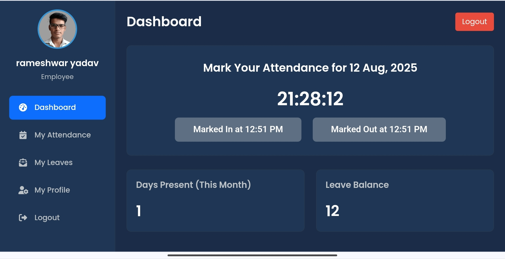

# Employee Attendance Management System


[](https://youtu.be/QW97JJklBEs?feature=shared)
[](https://github.com/rameshwaryadav/employee-atttendance-management-system)


An efficient and user-friendly web application to manage employee attendance, leaves, and departments. This system provides separate, feature-rich panels for both administrators and employees.

## Screenshots

### Home Page


### Admin Panel


### Employee Panel



## Features

### Admin Panel
- **Secure Login:** Dedicated login portal for administrators.
- **Interactive Dashboard:** A comprehensive overview with key metrics like total employees, departments, and leave statuses, visualized with dynamic charts.
- **Department Management:** Full CRUD (Create, Read, Update, Delete) functionality for managing company departments.
- **Employee Management:** Complete module to add, view, edit, and delete employee records.
- **Attendance Overview:** A detailed view of daily attendance records with filtering capabilities.
- **Leave Management:** A dedicated section to view all employee leave applications and approve or reject them.

### Employee Panel
- **Secure Login:** Individual login for every employee.
- **Personalized Dashboard:** A dashboard to mark daily attendance (In-Time and Out-Time) and view summaries.
- **Attendance History:** Employees can view their complete monthly attendance records.
- **Leave Application:** A simple form to apply for leaves and track the status of their applications.
- **Profile Management:** Employees can view their profile and change their password.

## Tech Stack
- **Frontend:** HTML5, CSS3, JavaScript
- **Backend:** PHP
- **Database:** MySQL / MariaDB

## Setup & Installation

### Prerequisites
- A web server environment like XAMPP, WAMP, or MAMP.
- PHP 7.4 or higher.
- MySQL or MariaDB.

### Installation Steps
1.  **Clone the Repository:**
    ```sh
git@github.com:rameshwaryadav/employee-atttendance-management-system.git
    ```
    Or download the ZIP file and extract it to your `htdocs` or `www` directory.

2.  **Create the Database:**
    - Open phpMyAdmin.
    - Create a new database and name it `elms`.
    - Select the `elms` database and go to the "Import" tab.
    - Choose the `database.sql` file from the project directory and click "Go".

3.  **Configure Database Connection:**
    - Navigate to the `includes/` directory and open `dbh.php`.
    - Update the database credentials if they are different from the default (`root` and no password).

4.  **Run the Application:**
    - Start your web server (Apache and MySQL).
    - Open your browser and navigate to `http://localhost/employee-attendance-system/`.

## Login Credentials

### Admin
- **URL:** `http://localhost/employee-attendance-system/admin/login.php`
- **Username:** `admin`
- **Password:** `adminpass`

### Employee (Sample Accounts)
- **URL:** `http://localhost/employee-attendance-system/employee/login.php`
- **Email:** `rameshwar01@outlook.in`
- **Password:** `yadav123`

## Connect with Me

You can connect with me on [LinkedIn](https://www.linkedin.com/in/rameshwar01/).